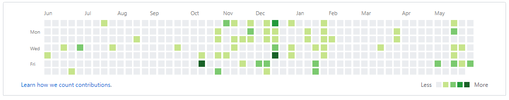

### GitGraphGud&copy;

#### Are you tired of your GitHub graph looking like this?



- Sure, you are productive, but some employers might still look at this and think you are wasting a lot of your "free time" not coding.

#### Maybe you are fresh out of college and it looks more like this:


- Everyone has to start somewhere, and it is nothing to be ashamed of.

#### Introducing: GitGraphGud&copy;

- Just **fork** this repo, **update** username and email in `config.py`, and allow **Github's Actions** to run it as a CRON job everyday.
- Soon your GitHub graph will be looking like a sea of... 
```diff 
+ GREEN
```

#### How does it work?

- It is simple. Contributions on the graph are just how many commits, additions, pull requests, etc. that you make.
- GitGraphGud&copy; just creates a file, adds to it, and deletes it.
- Changes are committed along the way, and your contributions are recorded.
- You could even stick this in a private repo, set your private contributions to 'visible', and nobody would ever know.
- You can run this whole operation anywhere with minimal resources forever.
- You think that kind of automation is easy?
- Or cheap?
- Please donate to my Patreon once I set one up.
